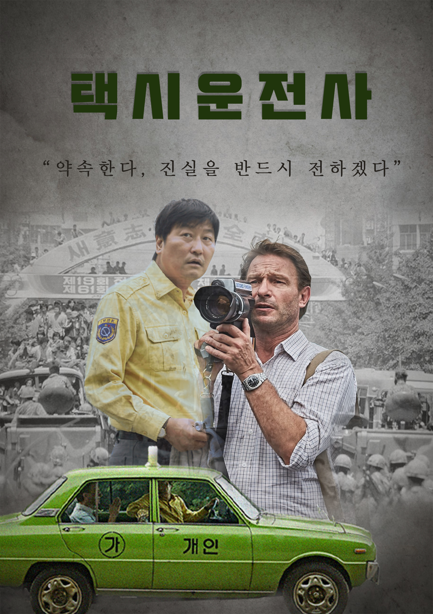
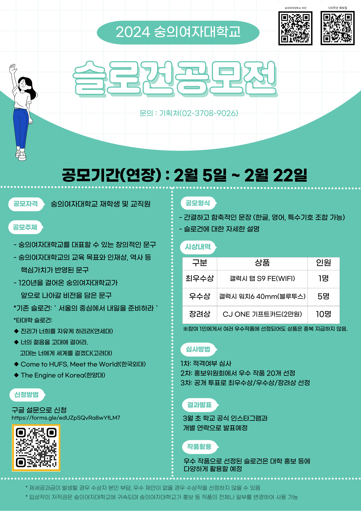

# Design

## Banner Design

### Banner01
<table>
<tr align="center">
<td width="50%">
  <B>💻작업: 100% 본인작업</B>  
  <B>⚒️작업툴: 미래캔버스</B> 
  <B>📆작업기간: 24년 4월(1일 소요)</B>
</td>
</tr>
<tr><td></td></tr>
<tr><td></td></tr>
</table>

### Banner02
<table>
<tr align="center" width="50%">
<td>
  <B>💻작업: 100% 본인작업</B>  
  <B>⚒️작업툴: 미래캔버스, 포토샵</B> 
  <B>📆작업기간: 24년 5월(1일 소요)</B>
</td>
</tr>
<tr width="50%"><td></td></tr>
</table>

### Banner03
<table>
<tr align="center">
<td width="50%">
  <B>💻작업: 100% 본인작업</B>  
  <B>⚒️작업툴: 미래캔버스, 포토샵</B> 
  <B>📆작업기간: 24년 8월(1일 소요)</B>
</td>
</tr>
<tr><td></td></tr>
</table>

## Poster Design

### Poster01
<table>
<tr align="center">
<td width="50%">
  <B>[ 영화포스터 리디자인 ]</B>    
  <B>💻작업: 100% 본인작업</B>  
  <B>⚒️작업툴: 포토샵</B>  
  <B>📆작업기간: 21년 6월(3일 소요)</B>
</td>
<td width="50%"></td></tr>
</table>

### Poster02
<table>
<tr align="center">
<td width="50%">
  <B>[ 대학 슬로건 공모전 포스터 ]</B>   
  <B>💻작업: 100% 본인작업</B>  
  <B>⚒️작업툴: 미리캔버스</B>  
  <B>📆작업기간: 24년 3월(1일 소요)</B>
</td>
<td width="50%"></td></tr>
</table>

### Poster03
<table>
<tr align="center">
<td width="50%">
  <B>[ 서울 마이칼리지 챌린지업 사업 운영 포스터 ]</B>   
  <B>💻작업: 100% 본인작업</B>  
  <B>⚒️작업툴: 포토샵</B>  
  <B>📆작업기간: 24년 6월(1일 소요)</B>
</td>
<td width="50%"></td>
</tr>
<tr align="center">
<td width="50%">
  <B>[ 서울 마이칼리지 챌린지업 사업 운영 포스터 ]</B>   
  <B>💻작업: 100% 본인작업</B>  
  <B>⚒️작업툴: 포토샵</B>  
  <B>📆작업기간: 24년 7월(1일 소요)</B>
</td>
<td width="50%"></td>
</tr>
</table>
